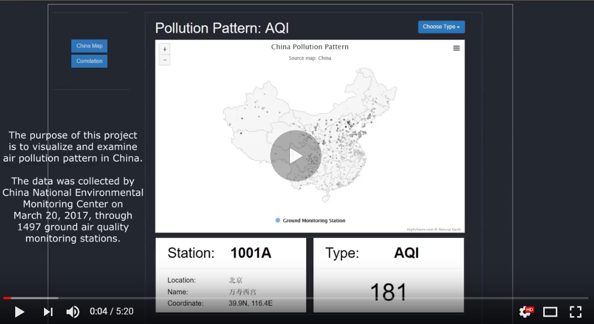

# Analysis and Visualization of China National Air Quality

China is now the world’s second largest and fastest-growing major economy with an average
growth rate of 10% for the past 30 years. However, its fast industrialization and development
rate persists at the cost of the environment. There are now three major crises that are confronting
China, which are resource shortage, environmental pollution and ecology destruction. Among
these three, the environmental pollution, especially atmospheric pollution has recently earned its
most notorious reputation. To curb the increasing atmospheric pollution, the Executive Meetings
of the State Council published the revised Ambient Air Quality Standard in February 2012, and
continuously introduced many stricter nation-wide policies and regulations regarding to the air
pollution in the following years. Because the regional energy consumption structure and
productivity may vary over time, the geographical pattern air pollution may also vary. Thus, a
latest analysis on the most recent air pollution pattern is necessary. The analytical results may
help the authorities adjust the current regulations or introduce new targeted regulations in time.

This project uses Python and D3.js to analyze and visualize China National Air Quality Dataset of March 2017. Check 'final report.pdf' to see more details

# Demo Video 

